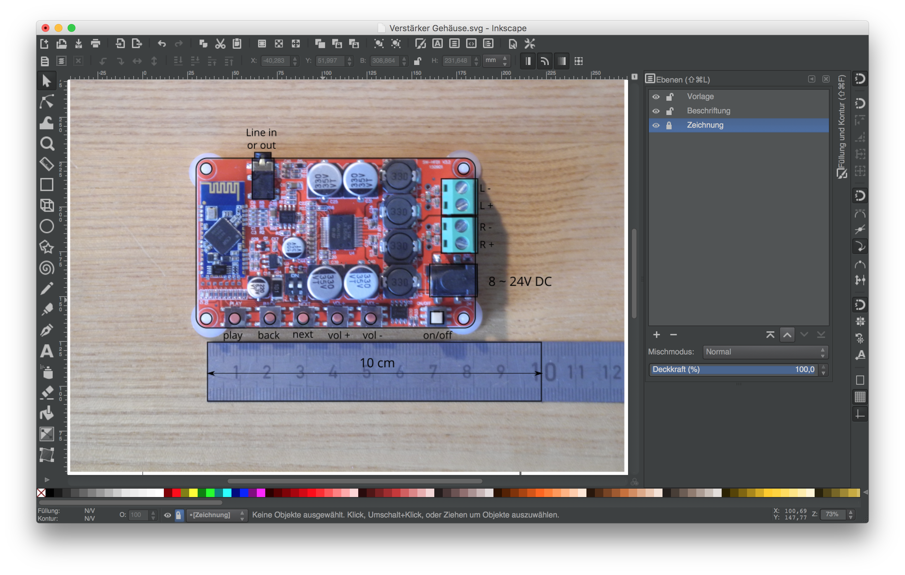

# TDA7492P bluetooth audio amplifier case

This is a case for the bluetooth audio receiver and amplifier TDA7492P generally [available from AliExpress and the like](https://de.aliexpress.com/wholesale?catId=0&initiative_id=SB_20170530064025&SearchText=TDA7492P+50W*2+Wireless+Bluetooth+4.0+Audio+Receiv). It comes in different slight variations like is often the case for these AliExpress products. 

The TDA7492P is a very cheap bluetooth audio receiver and amplifier that is popular for DIY audio amplifier projects. It is declared to produce 2x50W output power, although this is a bit of a miracle.

In this repository you find a case that you can 3D print to fit this board inside.

## How the model was build

The case was drawn from pictures in [Inkscape](inkscape.org) and then exported to [OpenSCAD](openscad.org) with the [Inkscape to OpenSCAD converter](https://www.thingiverse.com/thing:24808/#files)
like shown in [this tutorial](http://www.instructables.com/id/Convert-any-2D-image-to-a-3D-object-using-OpenSCAD/).

### Step 1 outline components:

I started with outlining the components that need access from the outside (buttons, line in, DC in, speaker wire nuts):



### Step 2 add a shell where everything fits inside:

I planned to fit some bigger knobs to operate the buttons of the board, so I made the shell of the case a bit bigger than it needs to be. I drew the shell with a 1.6 mm line in Inkscape, which results in 4 lines with a 0.4 mm 3D printer nozzle.


It is important to convert strokes to paths.
Go to Path > Stroke to Path (or in German: 
Pfad > Kontur in Pfad umwandeln) to convert the 1.6 mm outline to two lines, one for the outer shell, one for the inner. 


### Step 3 layers for top and bottom, screw holes, button holes, etc.
I then added drawings for everything that is going on inside the shell and made several layers for every part where the shell is broken to make room for parts that need to be accessed from the outside. Every single layer will be exported separately to OpenSCAD to be combined later in OpenSCAD.  


### Step 4 OpenScad model

If you followed [the instructions ](http://www.instructables.com/id/Convert-any-2D-image-to-a-3D-object-using-OpenSCAD/) to install the 
[Inkscape to OpenSCAD converter](https://www.thingiverse.com/thing:24808/#files)
you can export the individual layers via 
Extensions > Generate from Path > Paths to OpenSCAD... (in German
Erweiterungen > Aus Pfad erzeugen > Paths to OpenSCAD...).

You end up with a file that holds the code for an OpenSCAD module. It starts with:

```{openscad}
module Ring(h)
{
  scale([1, 1, 1]) union()
  {
    difference()
    {
      linear_extrude(height=h)
        polygon([[-39,561501, -28,73
        ...here comes a lot of numbers
        ]])
    }
  }
}
```

You can see that a `linear_extrude` is used to extrude a `polygon`. This polygon holds the drawing you selected and exported in Inkscape (stored in a lot of numbers). By changing `h` you can change the extrude height. 


In my case there was something wrong with the scale that was produced by the OpenSCAD export extension. I had to change `scale([25.4/90, -25.4/90, 1])` to `scale([1, 1, 1])`.

The buttom that holds the board looks like this:


I copied the code of all the modules from the single files and put it into one large file like you can see in the next picture (note that the code lines for the modules are folded away for a better overview). I gave the modules different extrusion height and glued them together by `union`. Then I cut a hole for the 3,5mm headphone jack and some ventilation vents facilitating the `difference` operator. 


The case that goes on top:


For the knobs I wrote simple OpenSCAD script. There is one knob with a longer head for the on/off switch:


...and this one for all the other buttons:


### Step 5 printing and assembly

You find `stl` files included in the repository that you can print directly. I printed the knobs individualy with special care about cooling and printing speed to get a nice clean surface. Print the buttons with the smaller diameter on the print bed, even though you produce an overhang this way. This guarantees that the surface you touch with your fingers later will be nice and smooth. The overhang is there to keep the knobs from falling out of the case. It might needs some cleaning after the print.

The top I printed face down, so that the surface you see later is also nice and smooth. The bottom is also printed in a way that the outside face is on the printer bed and hence nice and smooth.  

Put the board on the spacer rings of the bottom and place the top above it. Then screw 4 screws from the bottom through the holes in the bottom part, throgh the holes of the board into the holes of the top part. 

The case is later standing on the screws.  This is not optimal. I planned to maybe print some sort of spacers or caps for them, so you don't scratch the surface of your table. But I didn't test that out yet. 